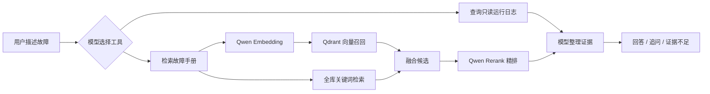

# MiniOps Agent

MiniOps Agent 是一个面向运维故障排查的轻量 RAG Agent。用户可以用自然语言描述故障，模型自主选择知识库检索与只读运行日志查询，再依据可追溯证据回答；证据不足时会追问，而不是编造处理结论。

## 项目亮点

- 将 8 份 Markdown 故障手册按标题和小节切分为 24 个知识片段，并保留手册、章节和原文引用。
- 使用 Qwen 文本向量召回语义相近内容，同时融合全库关键词分数，兼顾同义表达、服务名和错误码。
- 对混合召回候选使用 `qwen3-rerank` 精排，返回 Top-1 证据及完整引用来源。
- 提供受限的只读日志工具，只能查询配置目录中的 JSONL 日志，支持服务、级别、关键词和时间窗口过滤。
- 支持模型 Function Calling、多轮追问、会话持久化、服务重启恢复与证据不足拒答。
- 提供 FastAPI、本地聊天页面、离线兜底模式和可执行回归评测。

## 工作流程



向量接口不可用时，检索器会退回本地哈希向量与关键词融合，因此测试和本地演示不依赖外部网络。Rerank 不可用时保留混合召回顺序。

## 主要模块

| 文件 | 作用 |
|---|---|
| `retrieval.py` | 文档切分、Embedding、Qdrant 索引、关键词融合与 Rerank |
| `tools.py` | `search_runbooks` 与 `query_logs` 两个只读工具 |
| `agent.py` | 模型—工具—观察循环、追问和证据门禁 |
| `runtime_logs.py` | 真实 JSONL 运行日志、目录白名单和文件轮转 |
| `session_store.py` | 保存并恢复每个会话最近 12 条消息 |
| `app.py` | FastAPI 接口、本地页面与启动事件 |
| `benchmark.py` | 加载评测集并计算任务、证据和排序指标 |

## 快速开始

环境要求：Python 3.10+；也可以仅使用 Docker Desktop 运行。

```powershell
git clone <your-repository-url>
cd miniops-agent
python -m venv .venv
.\.venv\Scripts\Activate.ps1
python -m pip install -r requirements.txt
Copy-Item .env.example .env
python -m uvicorn app:app --reload --port 8090
```

浏览器打开 `http://127.0.0.1:8090`，接口文档为 `http://127.0.0.1:8090/docs`。Windows 也可以双击 `启动MiniOps.cmd`。

## Docker 运行

复制 `.env.example` 为 `.env` 并填写自己的模型配置，然后执行：

```powershell
docker compose up --build -d
docker compose ps
docker compose logs -f miniops
```

浏览器仍然访问 `http://127.0.0.1:8090`。停止并删除容器：

```powershell
docker compose down
```

镜像只包含 Python、项目依赖和源码，`.env` 不会进入镜像。Compose 在运行时注入环境变量，并把本地 `data/` 挂载到容器 `/app/data`，因此删除容器后索引、会话和日志仍会保留。

## 模型配置

在 `.env` 中分别配置：

- `LLM_*`：负责选择工具和生成证据回答的对话模型。
- `EMBEDDING_*`：把知识片段与用户问题转换为同一向量空间。
- `RERANK_*`：对混合召回的少量候选进行精排。

模型接口均采用 OpenAI-compatible 请求格式。API Key 只保存在本地 `.env`，不会提交到仓库。

## 日志查询边界

MiniOps 自身事件写入 `data/runtime-logs/miniops.jsonl`，每条记录包含 ISO 时间戳、服务、级别和消息。`MINIOPS_LOG_DIRECTORIES` 可追加其他获批的 JSONL 目录；模型只能提交查询条件，不能指定或遍历任意文件路径。

日志文件达到约 5 MB 时自动轮转，默认保留 5 个历史文件。查询结果仍需与手册证据共同判断；没有足够证据时返回追问或证据不足。

## 评测

项目包含 15 条真实模型回归任务，覆盖 8 类手册问题、3 条日志与手册联合查询、1 条连续追问、2 条信息不足追问和 1 条知识库外拒答。

| 指标 | 结果 |
|---|---:|
| 任务完成率 | **100%** |
| 证据命中率 | **100%** |
| Top-1 命中率 | **100%** |
| 中位延迟 | **17.7 秒** |

运行评测：

```powershell
python benchmark.py
```

当前结果保存在 `data/benchmark-report.json`。这是用于验证工具选择、引用和检索排序的小型自建回归集，不代表通用运维问答准确率。

## 测试

```powershell
python -m compileall -q .
python -m ruff check .
python -m pytest
```
